# DDD Repository 效能比較 PoC

> **DDD Aggregate Repository vs. 傳統資料模型 (Traditional Data Model)** -- 四種持久化策略的效能基準測試

## 目錄

- [專案概述](#專案概述)
- [為什麼這個比較很重要](#為什麼這個比較很重要)
- [四種方案總覽 (架構圖)](#四種方案總覽-架構圖)
- [領域模型類別圖](#領域模型類別圖)
- [資料庫 ER 圖](#資料庫-er-圖)
- [訂單狀態機](#訂單狀態機)
- [Aggregate 邊界圖](#aggregate-邊界圖)
- [核心操作序列圖](#核心操作序列圖)
- [N+1 問題視覺化](#n1-問題視覺化)
- [Save 策略比較流程圖](#save-策略比較流程圖)
- [CQRS 進階架構圖](#cqrs-進階架構圖)
- [測試場景設計原理 (最重要的部分)](#測試場景設計原理-最重要的部分)
- [SQL 執行次數分析表](#sql-執行次數分析表)
- [結果比較表](#結果比較表)
- [深入解析：核心差異](#深入解析核心差異)
- [常見反模式 (Anti-Pattern Gallery)](#常見反模式-anti-pattern-gallery)
- [效能成本模型](#效能成本模型)
- [DDD 代價最大的場景 Top 5](#ddd-代價最大的場景-top-5)
- [決策矩陣與建議](#決策矩陣與建議)
- [如何執行](#如何執行)
- [專案結構](#專案結構)
- [決策流程圖](#決策流程圖)
- [術語表 (Glossary)](#術語表-glossary)

---

## 專案概述

本 PoC (Proof of Concept) 透過 **17 個精心設計的測試場景 (A~O)**，量化比較四種持久化策略在 **訂單 (Order)** 這個經典業務場景下的效能差異：

| 方案 | 領域建模 | 持久化技術 | 核心特點 |
|------|---------|-----------|---------|
| **方案 1** | DDD Aggregate | JPA / Hibernate | 完整 ORM，自動 dirty checking，orphanRemoval |
| **方案 2** | DDD Aggregate | Raw JDBC | 手寫 SQL，batch insert，delete-then-insert 策略 |
| **方案 3** | 傳統資料模型 | JPA / Hibernate | Order 和 LineItem 為獨立 Entity，各自 CRUD |
| **方案 4** | 傳統資料模型 | Raw JDBC | 純 SQL，DB 端聚合計算，最小化 Java 端開銷 |

### 技術堆疊

| 技術 | 版本 |
|------|------|
| Java | 21 |
| Spring Boot | 4.0.3 |
| Hibernate | 7.x (隨 Spring Boot 4 管理) |
| PostgreSQL | 16 (via Testcontainers) |
| Testcontainers | 2.0.2 |
| 測試框架 | JUnit 5 + AssertJ |

---

## 為什麼這個比較很重要

在實際專案中，團隊常面臨一個關鍵抉擇：

> **「我們應該使用 DDD Aggregate 模式，還是傳統 CRUD 資料模型？」**

這個問題沒有標準答案，因為兩種方式各有取捨：

- **DDD Aggregate** 把「業務一致性」放在第一位 -- 所有操作都以 Aggregate 為單位，確保業務規則（Invariant）永遠不會被違反。代價是：即使只需要修改一個欄位，也必須載入整個 Aggregate。

- **傳統資料模型** 把「資料操作效率」放在第一位 -- 可以精確地只讀/寫需要的資料。代價是：業務一致性的維護散落在 Service 層的各處程式碼中，容易遺漏。

本 PoC 用**數據**回答這個問題，讓團隊在理解具體效能差異後做出有依據的決策。

---

## 四種方案總覽 (架構圖)

```mermaid
graph TB
    subgraph DomainLayer["領域層 (Domain Layer) -- 純業務模型"]
        Order["Order<br/>Aggregate Root"]
        LineItem["OrderLineItem<br/>子實體 (record)"]
        Status["OrderStatus<br/>列舉"]
        RepoInterface["OrderRepository<br/>介面"]
        Order --> LineItem
        Order --> Status
    end

    subgraph InfraLayer["基礎設施層 (Infrastructure Layer) -- 四種實作"]
        subgraph Approach1["方案 1: DDD + JPA"]
            DddJpa["DddJpaOrderRepository"]
            JpaEntity["JpaOrderEntity<br/>+ JpaOrderLineItemEntity"]
            SpringData["SpringDataJpaOrderRepository"]
            DddJpa --> JpaEntity
            DddJpa --> SpringData
        end

        subgraph Approach2["方案 2: DDD + JDBC"]
            DddJdbc["DddJdbcOrderRepository"]
            JdbcTemplate1["JdbcTemplate<br/>手寫 SQL + batch"]
            DddJdbc --> JdbcTemplate1
        end

        subgraph Approach3["方案 3: 傳統 + JPA"]
            TradJpaService["TraditionalJpaOrderService"]
            TradJpaOrder["TraditionalJpaOrder"]
            TradJpaItem["TraditionalJpaLineItem"]
            TradJpaService --> TradJpaOrder
            TradJpaService --> TradJpaItem
        end

        subgraph Approach4["方案 4: 傳統 + JDBC"]
            TradJdbcService["TraditionalJdbcOrderService"]
            JdbcTemplate2["JdbcTemplate<br/>手寫 SQL + DB 端聚合"]
            TradJdbcService --> JdbcTemplate2
        end
    end

    subgraph DBLayer["資料庫層 (PostgreSQL 16)"]
        DB1["orders<br/>order_line_items<br/>(方案 1 & 2 共用)"]
        DB3["trad_orders<br/>trad_order_line_items<br/>(方案 3)"]
        DB4["jdbc_orders<br/>jdbc_order_line_items<br/>(方案 4)"]
    end

    RepoInterface -.->|"implements"| DddJpa
    RepoInterface -.->|"implements"| DddJdbc

    DddJpa --> DB1
    DddJdbc --> DB1
    TradJpaService --> DB3
    TradJdbcService --> DB4

    style DomainLayer fill:#e8f5e9,stroke:#2e7d32
    style InfraLayer fill:#e3f2fd,stroke:#1565c0
    style DBLayer fill:#fff3e0,stroke:#ef6c00
    style Approach1 fill:#bbdefb,stroke:#1976d2
    style Approach2 fill:#bbdefb,stroke:#1976d2
    style Approach3 fill:#c8e6c9,stroke:#388e3c
    style Approach4 fill:#c8e6c9,stroke:#388e3c
```

### 架構關鍵差異

| 面向 | DDD 方案 (1 & 2) | 傳統方案 (3 & 4) |
|------|------------------|------------------|
| **進入點** | `OrderRepository` 介面 | `Service` 類別 |
| **操作單位** | 整個 Aggregate (Order + 所有 LineItems) | 個別 Entity (Order 或 LineItem) |
| **業務邏輯位置** | Domain Model 內 (`Order.addLineItem()`) | Service 層 (`recalculateTotal()`) |
| **DB 對映** | 需要 ACL (Anti-Corruption Layer) 轉換 | 直接對映 DB 表 |

---

## 領域模型類別圖

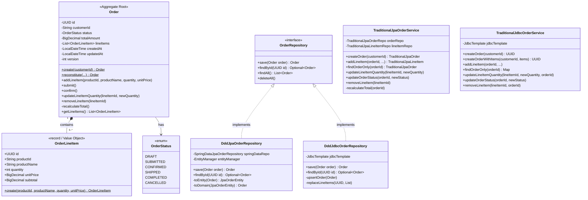

### 設計重點說明

1. **`Order` 是 Aggregate Root** -- 它是唯一的進入點，外部不能直接操作 `OrderLineItem`。所有修改都必須透過 `Order` 的方法（如 `addLineItem()`、`removeLineItem()`），這確保了 `totalAmount = sum(subtotals)` 這個業務不變式 (Invariant) 永遠成立。

2. **`OrderLineItem` 是 Java `record`** -- 它是不可變的值物件。要修改數量，必須建立新的 record 實例。

3. **`reconstitute()` 工廠方法** -- 從資料庫重建 Aggregate 時使用，不觸發業務驗證邏輯，因為資料已經是驗證過的。

4. **傳統方案沒有共同介面** -- `TraditionalJpaOrderService` 和 `TraditionalJdbcOrderService` 是獨立的 Service 類別，直接對應 DB 操作，不經過 Domain Model。

---

## 資料庫 ER 圖

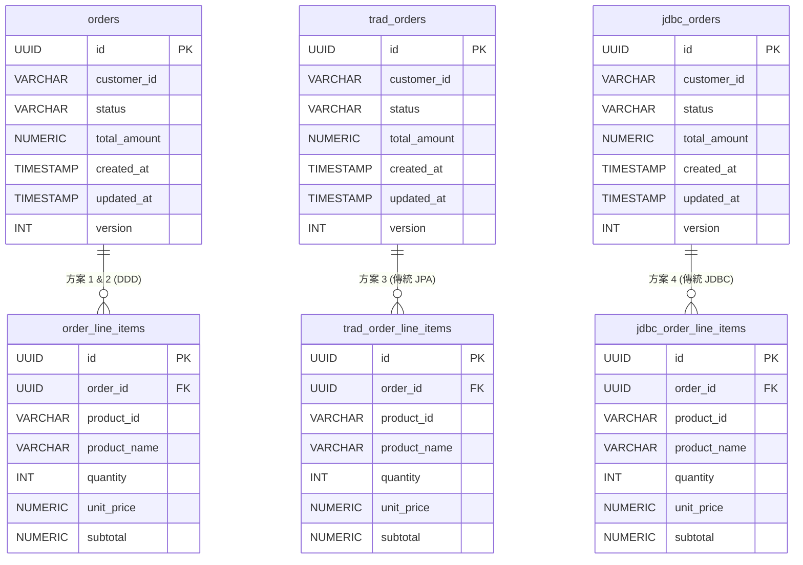

### 為什麼要用不同的表？

三組表的欄位結構完全相同，但分開存放是為了：

1. **隔離測試** -- 每個方案操作自己的表，不會互相干擾
2. **真實反映架構差異** -- DDD 方案 1 和 2 共用同一組表（因為它們共用同一個 Domain Model），而傳統方案各自獨立
3. **效能基準的公平性** -- 每個方案面對的 DB 資料量一致

---

## 訂單狀態機

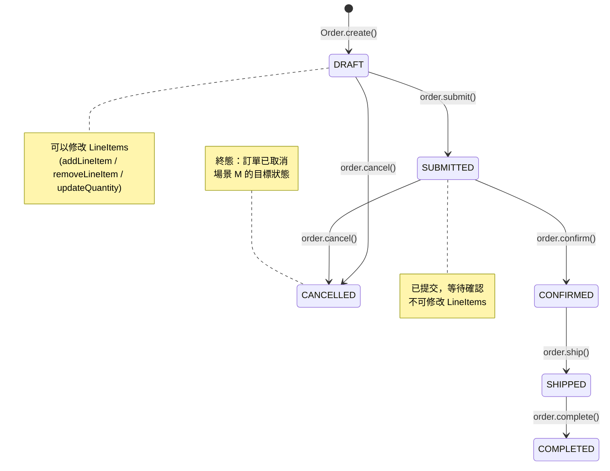

---

## Aggregate 邊界圖

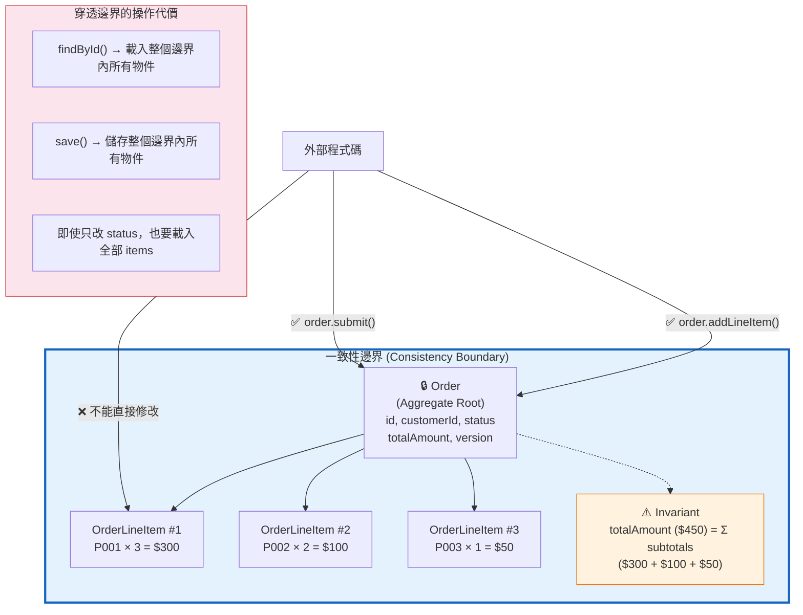

---

## 核心操作序列圖

### a) 寫入訂單 -- 比較 Aggregate 整體存儲 vs 逐筆存儲

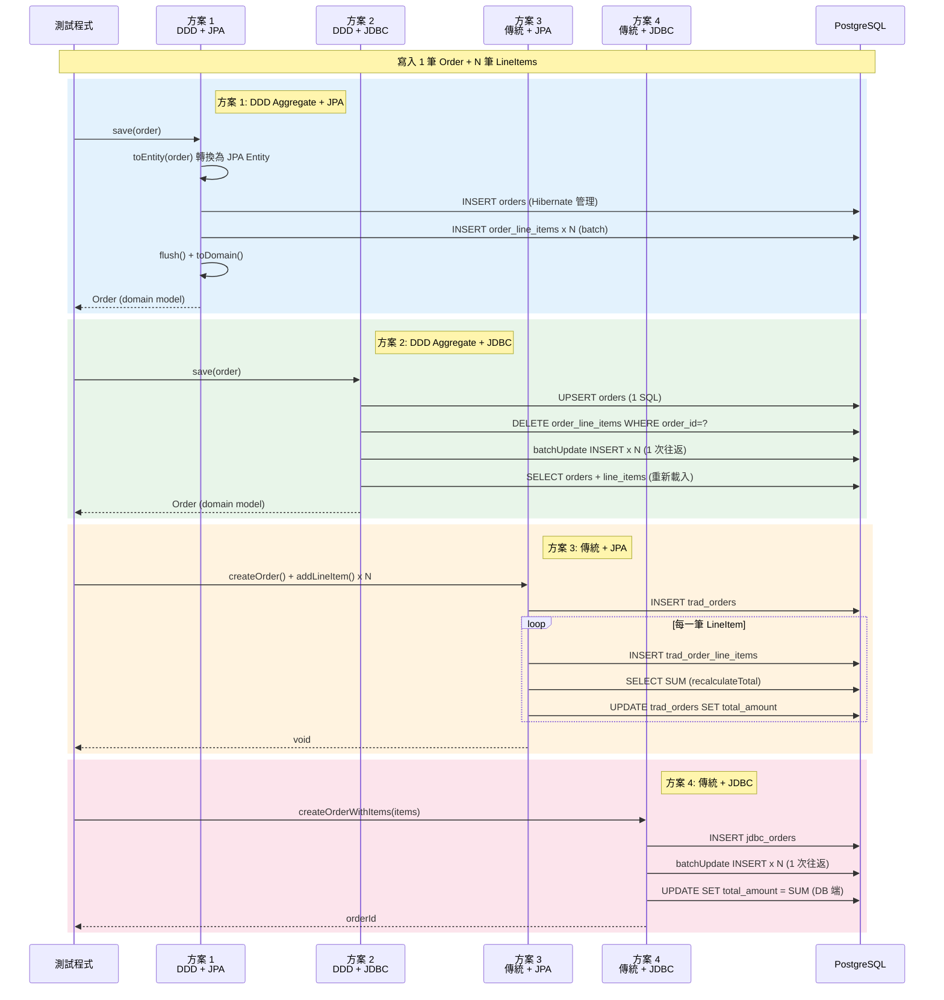

**關鍵差異：**
- **方案 2 (DDD+JDBC)** 和 **方案 4 (傳統+JDBC)** 都使用 `batchUpdate`，一次往返插入所有 items
- **方案 3 (傳統+JPA)** 最慢 -- 每新增一筆 item 就要 `recalculateTotal()`，導致 N 次額外的 SELECT + UPDATE
- **方案 1 (DDD+JPA)** 有 Hibernate 的 entity mapping 和 dirty checking 開銷，但 batch insert 有優化

### b) 讀取完整 Aggregate -- JOIN FETCH vs 2-SQL vs 分離查詢

```mermaid
sequenceDiagram
    participant Test as 測試程式
    participant DddJpa as 方案 1<br/>DDD + JPA
    participant DddJdbc as 方案 2<br/>DDD + JDBC
    participant TradJpa as 方案 3<br/>傳統 + JPA
    participant TradJdbc as 方案 4<br/>傳統 + JDBC
    participant DB as PostgreSQL

    Note over Test,DB: 讀取 1 筆 Order + 200 筆 LineItems

    rect rgb(227, 242, 253)
        Note right of DddJpa: 方案 1: JOIN FETCH (1 SQL，但結果集大)
        Test->>DddJpa: findById(id)
        DddJpa->>DB: SELECT o FROM JpaOrderEntity o<br/>LEFT JOIN FETCH o.lineItems<br/>WHERE o.id = :id
        Note right of DB: 1 SQL，結果集 200 rows
        DB-->>DddJpa: ResultSet (200 rows)
        DddJpa->>DddJpa: Hibernate 映射為 Entity 物件
        DddJpa->>DddJpa: toDomain() 轉換為 Domain Model
        DddJpa-->>Test: Optional&lt;Order&gt;
    end

    rect rgb(232, 245, 233)
        Note right of DddJdbc: 方案 2: 精確 2-SQL (無 ORM 開銷)
        Test->>DddJdbc: findById(id)
        DddJdbc->>DB: SELECT * FROM orders WHERE id = ?
        DB-->>DddJdbc: 1 row
        DddJdbc->>DB: SELECT * FROM order_line_items<br/>WHERE order_id = ?
        DB-->>DddJdbc: 200 rows
        DddJdbc->>DddJdbc: Order.reconstitute() 手動組裝
        DddJdbc-->>Test: Optional&lt;Order&gt;
    end

    rect rgb(255, 243, 224)
        Note right of TradJpa: 方案 3: 分離查詢 (2 SQL，經 JPA)
        Test->>TradJpa: findOrderWithItems(orderId)
        TradJpa->>DB: SELECT FROM trad_orders WHERE id = ?
        DB-->>TradJpa: TraditionalJpaOrder
        TradJpa->>DB: SELECT FROM trad_order_line_items<br/>WHERE order_id = ?
        DB-->>TradJpa: List&lt;TraditionalJpaLineItem&gt;
        TradJpa-->>Test: OrderWithItems
    end

    rect rgb(252, 228, 236)
        Note right of TradJdbc: 方案 4: 分離查詢 (2 SQL，純 JDBC)
        Test->>TradJdbc: findOrderWithItems(orderId)
        TradJdbc->>DB: SELECT * FROM jdbc_orders WHERE id = ?
        DB-->>TradJdbc: Map
        TradJdbc->>DB: SELECT * FROM jdbc_order_line_items<br/>WHERE order_id = ?
        DB-->>TradJdbc: List&lt;Map&gt;
        TradJdbc-->>Test: OrderWithItems
    end
```

### c) 只讀取 Order 表頭 (CQRS 動機)

```mermaid
sequenceDiagram
    participant Test as 測試程式
    participant DddJpa as 方案 1<br/>DDD + JPA
    participant DddJdbc as 方案 2<br/>DDD + JDBC
    participant TradJpa as 方案 3<br/>傳統 + JPA
    participant TradJdbc as 方案 4<br/>傳統 + JDBC
    participant DB as PostgreSQL

    Note over Test,DB: 只需要 Order 表頭資訊（不需要 LineItems）<br/>但 DDD 被迫載入完整 Aggregate

    rect rgb(255, 205, 210)
        Note right of DddJpa: 方案 1: 被迫載入 200 筆 LineItems!
        Test->>DddJpa: findById(id)
        DddJpa->>DB: SELECT o JOIN FETCH o.lineItems<br/>WHERE o.id = :id
        Note right of DB: 回傳 200 rows<br/>(其實只需要 1 row!)
        DB-->>DddJpa: ResultSet (200 rows)
        DddJpa->>DddJpa: 映射 200 個 Entity 物件 (浪費!)
        DddJpa-->>Test: Optional&lt;Order&gt; (只用 order.getStatus())
    end

    rect rgb(255, 205, 210)
        Note right of DddJdbc: 方案 2: 同樣被迫載入所有 items
        Test->>DddJdbc: findById(id)
        DddJdbc->>DB: SELECT orders + SELECT line_items
        Note right of DB: 2 SQL，仍然載入全部
        DB-->>DddJdbc: 1 + 200 rows
        DddJdbc-->>Test: Optional&lt;Order&gt;
    end

    rect rgb(200, 230, 201)
        Note right of TradJpa: 方案 3: 精確查詢 -- 只讀 Order 表
        Test->>TradJpa: findOrderOnly(orderId)
        TradJpa->>DB: SELECT FROM trad_orders WHERE id = ?
        Note right of DB: 只回傳 1 row!
        DB-->>TradJpa: TraditionalJpaOrder
        TradJpa-->>Test: TraditionalJpaOrder
    end

    rect rgb(200, 230, 201)
        Note right of TradJdbc: 方案 4: 同樣精確 -- 1 SQL
        Test->>TradJdbc: findOrderOnly(orderId)
        TradJdbc->>DB: SELECT * FROM jdbc_orders WHERE id = ?
        DB-->>TradJdbc: Map
        TradJdbc-->>Test: Map
    end
```

**這就是 CQRS 的動機！** DDD Repository 的設計約束要求「以 Aggregate 為單位存取」，這意味著即使只需要一個欄位，也必須載入整個 Aggregate（含所有子實體）。對 Query Side 來說，這是巨大的浪費。

### d) 只更新 Status -- 部分更新的極端案例

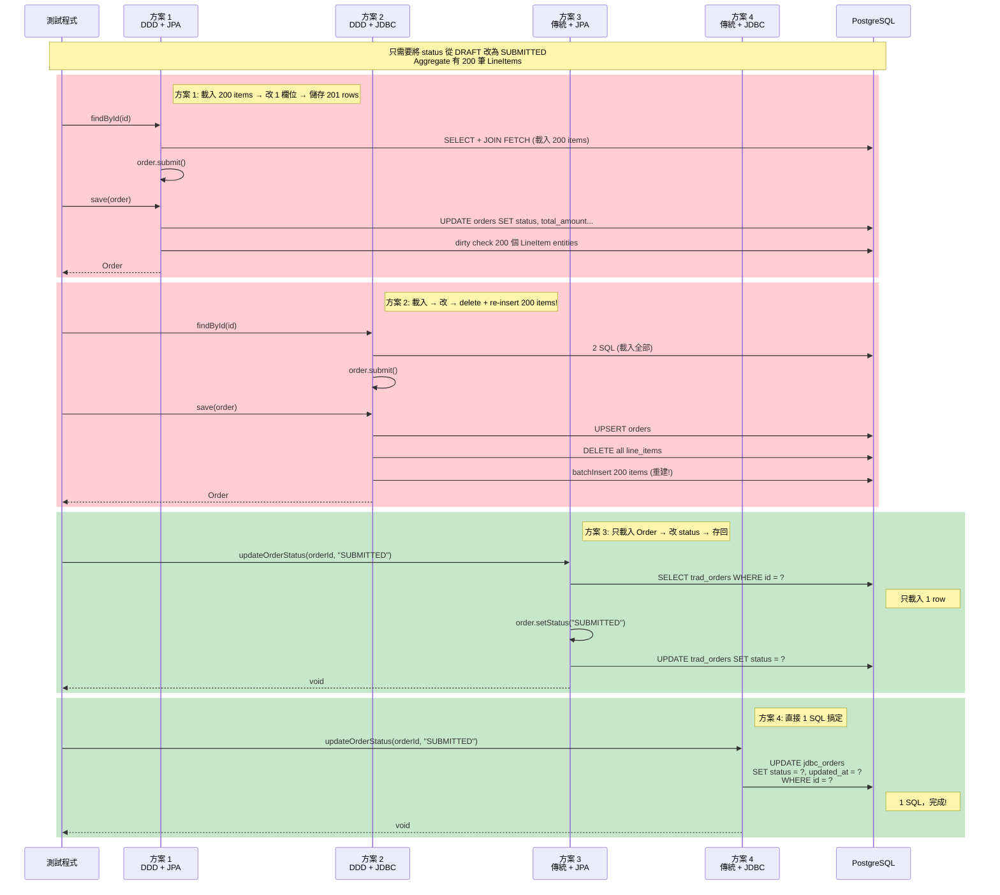

**這是 DDD 代價最極端的案例。** 方案 2 尤其誇張 -- 為了改一個 status 欄位，它執行了：DELETE 200 筆 + INSERT 200 筆 items。而方案 4 只需要 1 條 SQL。

---

## N+1 問題視覺化

場景 H (列表查詢 100 筆 Orders) 揭示的 N+1 問題瀑布流對比：

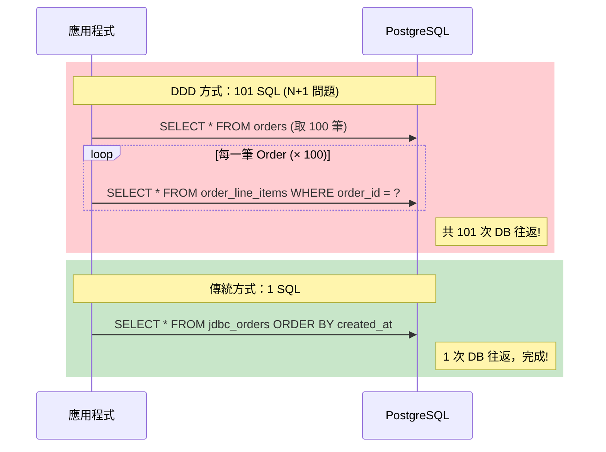

> **N+1 問題**：查詢 N 筆父資料，每筆再各查一次子資料，共 N+1 次 SQL。這是 DDD Repository 在列表查詢場景下最嚴重的效能陷阱。

---

## Save 策略比較流程圖

三種 `save()` 策略的步驟對比 — 以「修改 1 筆 LineItem 的 quantity」為例：

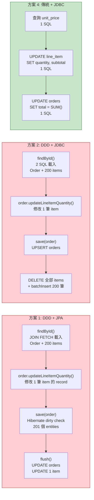

---

## CQRS 進階架構圖

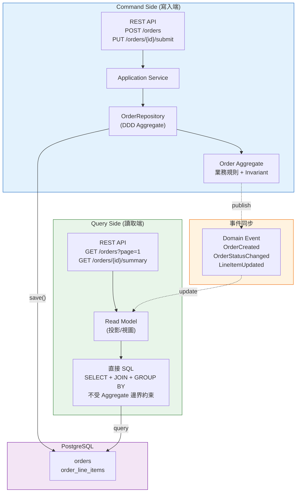

> **CQRS 的核心思想**：Command Side 用 DDD Aggregate 保護業務一致性；Query Side 用獨立的 Read Model 自由查詢。兩側各自最佳化，互不干擾。

---

## 測試場景設計原理 (最重要的部分)

以下是本 PoC 最核心的內容。每個場景都不是隨意設計的，它們各自揭示了 DDD 和傳統模式在特定情境下的行為差異。

### 場景 A-Small: 寫入 5 筆 LineItems

| 面向 | 說明 |
|------|------|
| **測試什麼** | 小型 Aggregate 的寫入效能 |
| **為什麼這樣設計** | 5 筆 items 是一個「小訂單」的典型場景。在這個規模下，所有方案的 SQL 次數差異不大，主要觀察的是**框架層的固定開銷**（ORM 初始化、entity 映射、persistence context 建立等）。就像短途旅行比的不是車速，而是「上車前的準備時間」。 |
| **揭示什麼差異** | ORM 開銷佔總時間的比例。在小 Aggregate 場景下，Hibernate 的 dirty checking、proxy 建立等「固定成本」佔比會特別高。 |
| **預期誰贏，為什麼** | **方案 4 (傳統+JDBC)** 或 **方案 2 (DDD+JDBC)** -- 無 ORM 開銷。但四者差距不大，因為資料量太小。 |

### 場景 A-Medium: 寫入 50 筆 LineItems

| 面向 | 說明 |
|------|------|
| **測試什麼** | 中型 Aggregate 的寫入效能 -- batch insert 策略開始發揮作用 |
| **為什麼這樣設計** | 50 筆是 batch insert 和 per-item save 開始產生明顯差距的分界點。方案 3 (傳統+JPA) 每新增一筆 item 都要執行 `recalculateTotal()`（1 次 SELECT SUM + 1 次 UPDATE），意味著 50 筆就要額外執行 100 條 SQL。 |
| **揭示什麼差異** | batch insert（方案 2、4）vs 逐筆 save + recalculate（方案 3）的巨大差距。這就像「一次搬 50 箱」vs「搬一箱、算一次總數、再搬一箱」的差異。 |
| **預期誰贏，為什麼** | **方案 4 (傳統+JDBC)** -- `createOrderWithItems()` 用 batchUpdate 一次插入 + DB 端 SUM 一次更新。方案 3 會是最慢的（逐筆 save + 50 次 recalculate）。 |

### 場景 A-Large: 寫入 200 筆 LineItems

| 面向 | 說明 |
|------|------|
| **測試什麼** | 大型 Aggregate 的寫入效能 -- Hibernate dirty checking 的壓力測試 |
| **為什麼這樣設計** | 200 筆是故意製造的「壓力場景」。Hibernate 在 `flush()` 時需要對每一個 managed entity 進行 dirty checking（逐欄位比較），200 個 `JpaOrderLineItemEntity` 意味著 200 次 dirty check。而 JDBC 方案只是多了一些 batch 參數。 |
| **揭示什麼差異** | DDD+JPA (方案 1) 的 dirty checking 開銷隨 Aggregate 大小線性增長。DDD+JDBC (方案 2) 的 delete-then-insert 策略在大 Aggregate 時反而簡單直接。 |
| **預期誰贏，為什麼** | **方案 2 (DDD+JDBC)** 或 **方案 4 (傳統+JDBC)** -- 都使用 batch insert，無 dirty checking 開銷。方案 1 (DDD+JPA) 的開銷會明顯增加。 |

### 場景 B: 讀取完整 Aggregate (200 筆 items)

| 面向 | 說明 |
|------|------|
| **測試什麼** | 讀取完整 Order（含所有 LineItems）的效能 |
| **為什麼這樣設計** | 這是「訂單詳情頁」的場景 -- 真的需要 Order + 所有 LineItems。方案 1 使用 `JOIN FETCH`（1 SQL，但結果集大），方案 2 使用 2 SQL（各自精確），方案 3 & 4 也是 2 SQL 但經過/不經過 JPA。 |
| **揭示什麼差異** | JPA entity 映射成本 vs JDBC 手動映射成本。JOIN FETCH 的結果集包含重複的 Order 欄位（每一 row 都重複），而 2-SQL 策略的結果集更精簡。 |
| **預期誰贏，為什麼** | **方案 4 (傳統+JDBC)** -- 2 SQL + Map 映射（最低開銷）。方案 2 (DDD+JDBC) 緊追其後，但多了 `Order.reconstitute()` 的物件建構成本。 |

### 場景 C: 批次建立 500 筆 Order x 5 items

| 面向 | 說明 |
|------|------|
| **測試什麼** | 高吞吐量場景下的持久化效能（模擬批次匯入、EOD 處理） |
| **為什麼這樣設計** | 500 筆 Order 是為了觀察 Hibernate persistence context 的記憶體壓力。JPA 方案每 50 筆就需要 `clear()` persistence context（避免 OutOfMemoryError），而 JDBC 方案沒有這個問題。這模擬了「每天結帳時需要產生數百筆訂單」的真實場景。 |
| **揭示什麼差異** | persistence context 管理的隱性成本。JPA 在大量操作時，managed entities 會持續膨脹，需要手動 `clear()`。JDBC 則是「用完即走」，沒有狀態累積。 |
| **預期誰贏，為什麼** | **方案 4 (傳統+JDBC)** -- `createOrderWithItems()` 使用 batchUpdate，每筆 Order 只需 1 INSERT + 1 batchUpdate + 1 UPDATE。方案 1 (DDD+JPA) 會因 persistence context 壓力而最慢。 |

### 場景 D: 只讀 Order 表頭 (CQRS 動機)

| 面向 | 說明 |
|------|------|
| **測試什麼** | 當只需要 Order 表頭資訊時，DDD 被迫載入完整 Aggregate 的代價 |
| **為什麼這樣設計** | **這是整個 PoC 最重要的場景之一。** 它直接揭示了 DDD Repository 模式的核心限制：`OrderRepository.findById()` 的契約是回傳完整的 `Order` Aggregate，即使呼叫者只需要 `order.getStatus()`。Aggregate 有 200 筆 items，但一個都用不到。傳統方案可以只查 Order 表（1 row）。 |
| **揭示什麼差異** | DDD 的「Aggregate 完整性」vs 「按需查詢」的根本矛盾。這個矛盾正是 CQRS 模式的起源 -- Query Side 需要一個不受 Aggregate 邊界約束的獨立 Read Model。 |
| **預期誰贏，為什麼** | **方案 4 (傳統+JDBC)** 大幅領先 -- 1 SQL、1 row、零物件映射。DDD 方案會慢 5-20 倍，因為它們被迫載入 200 筆 LineItems。 |

### 場景 E: 更新 LineItem (修改數量)

| 面向 | 說明 |
|------|------|
| **測試什麼** | 修改子實體的操作效能 |
| **為什麼這樣設計** | 「修改訂單中某一項商品的數量」是極常見的操作。DDD 的做法是：載入完整 Aggregate（50 items）→ 找到目標 item → 呼叫 `updateLineItemQuantity()` → 重新計算 total → 存回整個 Aggregate。傳統做法是：直接 UPDATE 那一筆 row → recalculate total。 |
| **揭示什麼差異** | DDD「以 Aggregate 為單位操作」的核心代價。為了修改 1 筆 item，方案 2 (DDD+JDBC) 會 DELETE + INSERT 所有 50 筆 items。這是 DDD 用「更多 I/O」換取「業務一致性保證」的典型案例。 |
| **預期誰贏，為什麼** | **方案 4 (傳統+JDBC)** -- 1 UPDATE + 1 子查詢 UPDATE。DDD 方案會慢數倍。 |

### 場景 F: 只更新 Status

| 面向 | 說明 |
|------|------|
| **測試什麼** | 「只修改 Aggregate Root 屬性」的極端案例 |
| **為什麼這樣設計** | 這是 DDD 代價最極端的測試。Order 有 200 筆 items，但只需要把 status 從 DRAFT 改為 SUBMITTED。DDD 必須：載入 200 items → 改 1 欄位 → 存回 200 items。方案 4 只需 1 條 UPDATE SQL。200 筆 items 是故意放大的，讓差距一目了然。 |
| **揭示什麼差異** | DDD 的「全量操作」設計哲學在純 Command 場景下的最壞情況。如果這個差距無法接受，團隊應該考慮：(a) 使用 CQRS 分離讀寫模型，或 (b) 在 Repository 層為常見操作提供 optimized 方法（如 `updateStatus()`），但這會破壞 Aggregate 的統一介面。 |
| **預期誰贏，為什麼** | **方案 4 (傳統+JDBC)** 大幅領先（可能 10-50 倍），因為它只執行 1 SQL。DDD 方案是最大的輸家，尤其方案 2 會 DELETE+INSERT 200 筆 items。 |

### 場景 G: 刪除 LineItem

| 面向 | 說明 |
|------|------|
| **測試什麼** | 移除子實體（Aggregate 收縮）的效能 |
| **為什麼這樣設計** | 觀察不同策略處理「移除」的行為差異。方案 1 (DDD+JPA) 使用 `orphanRemoval=true`，Hibernate 自動 DELETE 被移除的 entity -- 方便但需載入全 Aggregate。方案 2 (DDD+JDBC) 使用 delete-then-insert（刪除所有 items 再重建 49 筆）。傳統方案直接 DELETE 1 row。 |
| **揭示什麼差異** | `orphanRemoval` 的便利性 vs 效能成本的取捨。DDD+JDBC 的 delete-then-insert 策略在移除場景下顯得特別浪費（刪全部 + 重建 49 筆）。 |
| **預期誰贏，為什麼** | **方案 4 (傳統+JDBC)** -- 1 DELETE + 1 UPDATE（recalculate）。方案 2 最浪費 I/O（DELETE 50 + INSERT 49）。 |

### 場景 H: 列表查詢 100 筆 Orders

| 面向 | 說明 |
|------|------|
| **測試什麼** | 「我的訂單」列表頁面 -- 讀取多筆 Orders 的效能 |
| **為什麼這樣設計** | 100 筆 Order 各有 10 筆 items。DDD 的 `findAll()` 必須為每個 Order 載入其 LineItems。方案 1 的 `findAll()` 沒有 JOIN FETCH（因為 Spring Data 的 `findAll()` 不自動 fetch），結果觸發 N+1 問題（1 SELECT 取 100 筆 orders + 100 個 SELECT 取各自的 items）。方案 2 的 `findAll()` 也類似（100 次子查詢）。傳統方案只需 1 SQL SELECT 所有 orders。 |
| **揭示什麼差異** | DDD 的 N+1 問題 -- 這是 DDD Repository 在列表查詢場景下的經典痛點。每多一筆 Order，就多一次 SQL。在 100 筆時，DDD 可能執行 101-201 條 SQL，而傳統只需 1 條。 |
| **預期誰贏，為什麼** | **方案 4 (傳統+JDBC)** 大幅領先 -- `SELECT * FROM jdbc_orders` 一條 SQL 搞定。DDD 方案會慢 10-100 倍。 |

### 場景 I: Invariant 正確性驗證

| 面向 | 說明 |
|------|------|
| **測試什麼** | `totalAmount = sum(subtotals)` 這個業務不變式在各種操作後是否始終成立 |
| **為什麼這樣設計** | **效能只是一個面向，正確性才是根本。** 這個場景不計時，純粹驗證：經過新增、修改數量、刪除 items 三種操作後，totalAmount 是否等於所有 subtotals 的加總。DDD 的 `recalculateTotal()` 在 Aggregate 內自動執行，不可能被遺漏。傳統方案的 `recalculateTotal()` 在 Service 層手動呼叫，如果開發者忘了呼叫（或呼叫時機不對），Invariant 就會被破壞。 |
| **揭示什麼差異** | DDD 的核心價值：**用設計約束 (design constraint) 守護業務一致性**，而非依賴開發者的記憶和紀律。兩種方案都通過了驗證，但 DDD 的正確性是「結構性保證」（不可能違反），傳統方案的正確性是「紀律性保證」（需要開發者每次都記得呼叫 recalculate）。 |
| **預期誰贏，為什麼** | 不適用（不計時）。但 DDD 在「可維護性」和「防錯能力」上勝出。當團隊擴大、程式碼變複雜時，傳統方案遺漏 recalculate 的風險會逐漸增加。 |

### 場景 J: 並發寫入 (Optimistic Locking)

| 面向 | 說明 |
|------|------|
| **測試什麼** | 兩個執行緒同時讀取並修改同一筆 Order 時的衝突偵測能力 |
| **為什麼這樣設計** | **不計時，驗正確性。** 並發修改是分散式系統的常見問題。JPA Entity 的 `@Version` 欄位會在 flush 時自動檢查版本號，若版本不一致則拋出 `OptimisticLockException`，確保不會「靜默覆蓋」。而 DDD+JDBC 使用 `ON CONFLICT DO UPDATE` 策略，沒有版本檢查，最後一次寫入會覆蓋前一次。 |
| **揭示什麼差異** | JPA `@Version` 提供的 Optimistic Locking 是 ORM 的重要安全網。JDBC 方案如果需要同等保護，必須手動在 SQL 中加入 `WHERE version = ?` 條件。 |
| **預期誰贏，為什麼** | 不適用（不計時）。但 **DDD+JPA 在並發安全性上勝出** — 它會自動偵測衝突並拋出例外，而 DDD+JDBC 的 Last Writer Wins 可能導致資料遺失。 |

### 場景 K: 分頁查詢 (200 Orders, 5 pages)

| 面向 | 說明 |
|------|------|
| **測試什麼** | 分頁查詢 200 筆 Orders，每頁 20 筆，讀取 5 頁的效能差異 |
| **為什麼這樣設計** | 模擬列表型 API（`GET /orders?page=2&size=20`）。DDD 的 `findAllPaged()` 使用 LIMIT/OFFSET 取得 Order 後，仍需為每個 Order 載入其 LineItems（N+1）。傳統方案只需 1 SQL `SELECT * FROM orders LIMIT 20 OFFSET 40`。 |
| **揭示什麼差異** | DDD 在分頁場景下的 N+1 問題。即使加了分頁，每一頁仍然觸發 20 次子查詢（載入 items）。5 頁共 100+5 = 105 SQL (DDD+JDBC) vs 5 SQL (傳統)。 |
| **預期誰贏，為什麼** | **傳統+JDBC** — 每頁 1 SQL，5 頁只需 5 次 DB 往返。DDD 方案慢 3-10 倍。 |

### 場景 L: 聚合報表 (500 Orders, count/sum/avg/groupBy)

| 面向 | 說明 |
|------|------|
| **測試什麼** | 對 500 筆 Orders 計算 count、sum、avg 和 groupBy status 的效能差異 |
| **為什麼這樣設計** | **這是 DDD 效能代價最極端的場景之一。** DDD 的 `computeAggregateSummary()` 必須先 `findAll()` 載入全部 500 筆 Orders（含所有 items），再用 Java Stream 計算統計值。傳統方案只需 2 條 SQL（`SELECT COUNT(*), SUM(total_amount), AVG(total_amount)` + `SELECT status, COUNT(*) GROUP BY status`），完全在 DB 端完成。 |
| **揭示什麼差異** | DDD 的「全量載入」vs 傳統的「DB 端聚合」。500 筆 Orders × 3 items = 載入 500+1500 筆資料到 Java 記憶體，加上物件映射和 GC 壓力。而傳統只需 2 次 DB 往返，回傳幾個數字。 |
| **預期誰贏，為什麼** | **傳統方案大幅領先**（可能 50-100 倍），因為它只回傳 aggregate 結果，不載入任何完整物件。 |

### 場景 M: 批次狀態更新 (200 DRAFT → CANCELLED)

| 面向 | 說明 |
|------|------|
| **測試什麼** | 將 200 筆 DRAFT 狀態的 Orders 批次更新為 CANCELLED |
| **為什麼這樣設計** | 模擬「系統自動取消超時未付款的訂單」。DDD+JDBC 的做法是：逐個載入 200 筆 Order（含所有 items）→ 修改 status → save（含 delete+insert items）。傳統+JDBC 的做法是：`UPDATE jdbc_orders SET status = 'CANCELLED' WHERE status = 'DRAFT'`（1 SQL）。 |
| **揭示什麼差異** | DDD「以 Aggregate 為單位操作」在批次場景下的代價。200 筆 Order × (載入 + 修改 + 儲存) = 數百甚至上千次 SQL。而傳統只需 1 SQL。DDD+JPA 的 `@Modifying` 可以用 JPQL 批次更新，但這繞過了 Aggregate 邊界。 |
| **預期誰贏，為什麼** | **傳統+JDBC** — 1 SQL 搞定。DDD+JDBC 最慢（逐個載入 + delete-then-insert items）。注意 DDD+JPA 使用 `@Modifying` JPQL 可能出乎意料地快，但這等於繞過了 DDD 的設計原則。 |

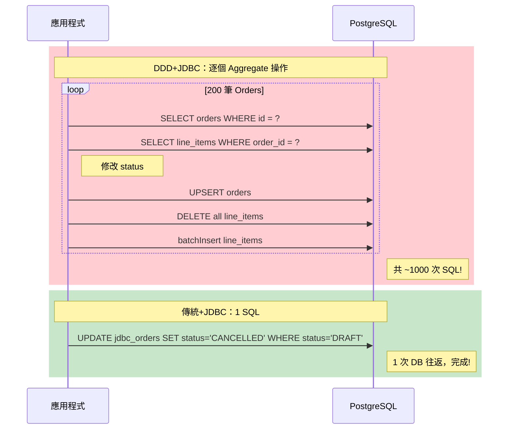

### 場景 N: 跨 Aggregate 查詢 (找包含特定商品的訂單)

| 面向 | 說明 |
|------|------|
| **測試什麼** | 找出所有包含商品 "P0" 的訂單 |
| **為什麼這樣設計** | 這是「查詢條件不在 Aggregate Root，而在子實體」的場景。DDD+JDBC 的做法是 `findAll()` 載入全部 Aggregate，再用 Java `filter()` 檢查每個 Order 的 items。DDD+JPA 可以先用 JPQL 查 item IDs 再逐個載入 Order。傳統+JDBC 直接 `SELECT DISTINCT o.* FROM orders o JOIN line_items li ON ... WHERE li.product_id = ?`。 |
| **揭示什麼差異** | DDD 在「查詢條件不在 Aggregate Root 上」時的先天劣勢。Aggregate Repository 的 `findById()`/`findAll()` 設計假設查詢以 Root 為維度，對子實體的查詢沒有高效支援。 |
| **預期誰贏，為什麼** | **傳統+JDBC** — 1 SQL JOIN 搞定。DDD+JDBC 需要載入全部資料再 filter（O(N) 全掃）。 |

### 場景 O: 投影查詢 (DTO: id, customerId, itemCount, totalAmount)

| 面向 | 說明 |
|------|------|
| **測試什麼** | 只需要 4 個欄位（id, customerId, itemCount, totalAmount），不需要完整 Order |
| **為什麼這樣設計** | 模擬 BFF (Backend For Frontend) 或 GraphQL 的場景 — 前端只需要摘要資訊，不需要完整 Aggregate。DDD 必須 `findAll()` 載入全部 Aggregate（含所有 items），再用 `stream().map()` 萃取需要的欄位。傳統+JDBC 直接 `SELECT o.id, o.customer_id, COUNT(li.id), o.total_amount FROM ... GROUP BY ...`。 |
| **揭示什麼差異** | DDD 的「全有或全無」問題。Aggregate Repository 只能回傳完整的 `Order` 物件，無法只回傳部分欄位。這在 API 只需要少數欄位的場景下是巨大的浪費。 |
| **預期誰贏，為什麼** | **傳統方案大幅領先** — 只回傳 4 個欄位，不載入任何 items 物件。DDD 方案慢 10-20 倍。 |

---

## SQL 執行次數分析表

每個場景 × 每個方案的精確 SQL 執行次數（N = LineItem 數量，M = Order 數量）：

| 場景 | DDD+JPA | DDD+JDBC | 傳統+JPA | 傳統+JDBC |
|------|---------|----------|----------|-----------|
| **A: Write N items** | 1 INSERT + N INSERT (batch) | 1 UPSERT + 1 DELETE + 1 batchInsert + 2 SELECT | 1 INSERT + N×(INSERT + SELECT SUM + UPDATE) = 3N+1 | 1 INSERT + 1 batchInsert + 1 UPDATE = 3 |
| **B: Read Full** | 1 JOIN FETCH | 2 SELECT | 2 SELECT | 2 SELECT |
| **C: Batch M×N** | M × (1+N INSERT) | M × (1 UPSERT + 1 DELETE + 1 batch + 2 SELECT) = 5M | M × (3N+1) | M × 3 |
| **D: Read Order Only** | 1 JOIN FETCH (載入全部!) | 2 SELECT (載入全部!) | 1 SELECT | 1 SELECT |
| **F: Update Status** | 1 JOIN FETCH + 1 UPDATE + dirty check | 2 SELECT + 1 UPSERT + 1 DELETE + 1 batch = 5 | 1 SELECT + 1 UPDATE = 2 | 1 UPDATE |
| **H: List M Orders** | M+1 (N+1 問題) | M+1 × 2 = 2M+1 | 1 SELECT | 1 SELECT |
| **K: Paged (P pages)** | P × (pageSize+1) | P × (1 + pageSize×2) | P × 1 | P × 1 |
| **L: Aggregate Report** | M+1 + M (items) | 2M+1 | 2-3 SQL | 2 SQL |
| **M: Bulk Update 200** | 1 JPQL UPDATE | 200 × 5 = ~1000 | 1 JPQL UPDATE | 1 SQL UPDATE |
| **N: Cross-Aggregate** | 1 JPQL + K × JOIN FETCH | 2M+1 + filter | 1 JPQL + 1 findAllById | 1 JOIN SQL |
| **O: Projection DTO** | M+1 (N+1) | 2M+1 | 1 SELECT | 1 JOIN + GROUP BY |

---

## 結果比較表

執行測試後，結果會以下列格式呈現（以下為表格格式，實際數值依環境而異）：

| 場景 | DDD+JPA | DDD+JDBC | 傳統+JPA | 傳統+JDBC | 最快方案 |
|------|---------|----------|----------|-----------|---------|
| A-Write-5items | 7.2 ms | 8.1 ms | 23.5 ms | **2.4 ms** | 傳統+JDBC |
| A-Write-50items | 18.8 ms | **4.4 ms** | 57.1 ms | 11.7 ms | DDD+JDBC |
| A-Write-200items | 36.5 ms | **7.6 ms** | 122.4 ms | 36.9 ms | DDD+JDBC |
| B-Read-Full-200items | 1.3 ms | **0.2 ms** | 1.4 ms | 0.6 ms | DDD+JDBC |
| C-Batch-500x5 | 456.1 ms | 287.1 ms | 875.2 ms | **156.7 ms** | 傳統+JDBC |
| D-Read-OrderOnly | 0.4 ms | 0.2 ms | 0.1 ms | **0.1 ms** | 傳統+JDBC |
| E-Update-LineItem | 1.0 ms | 1.2 ms | 0.4 ms | **0.2 ms** | 傳統+JDBC |
| F-Update-Status-Only | 1.6 ms | 4.1 ms | 0.1 ms | **0.1 ms** | 傳統+JDBC |
| G-Remove-LineItem | 5.3 ms | 3.9 ms | 23.8 ms | **1.4 ms** | 傳統+JDBC |
| H-List-100-Orders | 8.0 ms | 5.2 ms | 0.7 ms | **0.3 ms** | 傳統+JDBC |
| I-Invariant | PASS | PASS | PASS | PASS | ALL PASS |
| J-Concurrency | conflict ✓ | LWW ⚠️ | — | — | DDD+JPA (安全性) |
| K-Paginated-5pages | 15.1 ms | 5.1 ms | 4.8 ms | **2.2 ms** | 傳統+JDBC |
| L-Aggregate-Report | 22.7 ms | 22.1 ms | **0.3 ms** | 0.3 ms | 傳統+JPA |
| M-Bulk-Update-200 | 158.6 ms | 165.4 ms | 481.6 ms | **65.7 ms** | 傳統+JDBC |
| N-Cross-Aggregate | 6.8 ms | 5.5 ms | 3.4 ms | **0.8 ms** | 傳統+JDBC |
| O-Projection-DTO | 6.4 ms | 5.2 ms | **0.3 ms** | 1.0 ms | 傳統+JPA |

### 測量方式

- **Warmup**: 每個場景先執行 3 次暖機（讓 JIT 編譯器優化、連線池建立等）
- **Measured**: 接著執行 10 次，取平均值
- **單位**: 毫秒 (ms)

---

## 深入解析：核心差異

### 1. 什麼是 Aggregate？為什麼它很重要？

**Aggregate** 是 Domain-Driven Design (DDD) 中最核心的戰術模式之一。簡單來說：

> Aggregate 是一組相關物件的集合，它們一起構成一個「一致性邊界 (consistency boundary)」。所有修改都必須透過 Aggregate Root 進行。

以訂單為例：

```
Order (Aggregate Root)
  ├── OrderLineItem ("Product A", qty: 3, price: 100, subtotal: 300)
  ├── OrderLineItem ("Product B", qty: 2, price: 50,  subtotal: 100)
  └── totalAmount: 400  ← 必須永遠等於 300 + 100
```

**為什麼要有這個邊界？** 因為 `totalAmount` 必須永遠等於所有 `subtotal` 的加總。如果允許外部直接修改某個 LineItem 的 quantity 而不更新 totalAmount，資料就會不一致。Aggregate 的設計保證了這種情況**不可能發生** -- 因為所有修改都會經過 `Order.recalculateTotal()`。

### 2. DDD Repository vs 傳統 DAO -- 設計哲學的差異

| 面向 | DDD Repository | 傳統 DAO / Service |
|------|---------------|-------------------|
| **操作對象** | Aggregate（如 Order + 所有 LineItems） | 單一 Entity（Order 或 LineItem） |
| **介面設計** | `save(Order)`、`findById()` — 像一個「Aggregate 的集合」 | `saveOrder()`、`saveLineItem()`、`updateStatus()` — 像 DB 操作的包裝 |
| **業務邏輯** | 在 Domain Model 內（`order.addLineItem()` 自動 recalculate） | 在 Service 層（`service.addLineItem()` 手動 recalculate） |
| **一致性保證** | 結構性 -- 不可能繞過 Aggregate 去破壞 Invariant | 紀律性 -- 靠開發者記得在每個操作後 recalculate |
| **效能特性** | 載入/儲存整個 Aggregate（可能包含不需要的資料） | 精確操作需要的資料 |

**程式碼對比：**

```java
// === DDD 方式 (方案 1 & 2) ===
// 修改商品數量
Order order = orderRepository.findById(orderId);    // 載入完整 Aggregate
order.updateLineItemQuantity(itemId, newQuantity);   // 自動 recalculate
orderRepository.save(order);                         // 儲存整個 Aggregate

// === 傳統方式 (方案 3 & 4) ===
// 修改商品數量
TraditionalJpaLineItem item = lineItemRepo.findById(itemId);  // 只載入 1 筆
item.setQuantity(newQuantity);
item.setSubtotal(item.getUnitPrice().multiply(BigDecimal.valueOf(newQuantity)));
lineItemRepo.save(item);
recalculateTotal(orderId);   // ← 如果開發者忘了呼叫這行...
```

### 3. ORM 開銷：Dirty Checking、Entity Mapping、Persistence Context

**Dirty Checking** 是 Hibernate 最大的隱性成本。當你呼叫 `entityManager.flush()` 時，Hibernate 會：

1. 遍歷 persistence context 中所有 managed entities
2. 逐欄位比較每個 entity 的當前值和快照值 (snapshot)
3. 為有變化的 entity 產生 UPDATE SQL

以方案 1 為例，一筆有 200 個 items 的 Order 在 `flush()` 時，Hibernate 需要 dirty check 201 個 entity（1 個 Order + 200 個 LineItem）。即使只改了 status，200 個 LineItem 也會被逐一檢查。

**Entity Mapping** 是另一個成本。從 ResultSet 的每一 row 映射為 Java 物件，需要反射呼叫、型別轉換、proxy 建立等。JDBC 方案直接 `rs.getString()` / `rs.getBigDecimal()`，沒有這些中間層。

**Persistence Context** 是 JPA 的「一級快取」。它追蹤所有 managed entities 的狀態，在大量操作時（如場景 C 的 500 筆 orders）會消耗大量記憶體，需要定期 `clear()`。

### 4. 為什麼 DDD「載入全部」-- 正確性 vs 效能的取捨

DDD 的設計哲學是：

> **Aggregate 是一致性的邊界。在這個邊界內，所有的 Invariant 都必須在任何操作後成立。**

要保證 `totalAmount = sum(subtotals)`，最安全的方式就是在每次 `save()` 時重新計算。要重新計算，就需要所有的 LineItems。所以 `findById()` 必須載入完整 Aggregate。

這是一個**有意識的設計取捨**：

- **好處**：永遠不會出現 `totalAmount` 和 `subtotals` 不一致的情況
- **代價**：即使只需要 Order 表頭，也被迫載入所有 items

### 5. CQRS -- 為什麼 Query Side 需要獨立模型

場景 D 和 H 揭示了 DDD Repository 在查詢場景下的根本限制。解決方案就是 **CQRS (Command Query Responsibility Segregation)**：

```
Command Side (寫入)                    Query Side (讀取)
┌────────────────────┐                ┌────────────────────┐
│ Order Aggregate    │                │ OrderSummaryView   │
│ (完整 DDD 模型)     │                │ (只有需要的欄位)    │
│                    │                │                    │
│ Repository.save()  │    ───────>    │ SELECT id, status, │
│ Repository.findById│  (event/sync)  │   total, created   │
│                    │                │ FROM orders        │
└────────────────────┘                └────────────────────┘
用 Aggregate 保護一致性                  用扁平 SQL 最佳化查詢效能
```

Command Side 繼續使用 DDD Aggregate 保護業務一致性，Query Side 使用獨立的 Read Model 直接查 DB。兩者各司其職。

### 6. Batch Insert vs 逐筆 Save -- 為什麼差這麼多

考慮插入 200 筆 LineItems：

**逐筆 Save (方案 3 的 `addLineItem()` 呼叫 200 次)：**
```
SQL 1:  INSERT INTO trad_order_line_items VALUES (...)
SQL 2:  SELECT SUM(subtotal) FROM trad_order_line_items WHERE order_id = ?
SQL 3:  UPDATE trad_orders SET total_amount = ? WHERE id = ?
SQL 4:  INSERT INTO trad_order_line_items VALUES (...)
SQL 5:  SELECT SUM(subtotal) ...
SQL 6:  UPDATE trad_orders ...
...
SQL 600: UPDATE trad_orders ...
→ 總計 600 條 SQL，600 次 DB 往返
```

**Batch Insert (方案 2 & 4)：**
```
SQL 1:  INSERT INTO orders VALUES (...)          ← 1 次
SQL 2:  batchUpdate INSERT x 200                 ← 1 次往返
SQL 3:  UPDATE SET total_amount = SUM(...)       ← 1 次
→ 總計 3 條 SQL，3 次 DB 往返
```

差距是 **200 倍的 DB 往返次數**。每次 DB 往返都包含：網路延遲 + SQL 解析 + 執行 + 結果回傳。即使每次只多 0.5ms，200 次就是 100ms 的額外開銷。

---

## 常見反模式 (Anti-Pattern Gallery)

### 反模式 1: 在 Service 層繞過 Aggregate

```java
// ❌ Bad: 直接修改子實體，繞過 Aggregate Root
public void updateQuantity(UUID lineItemId, int newQty) {
    OrderLineItem item = lineItemRepo.findById(lineItemId);
    item.setQuantity(newQty);
    item.setSubtotal(item.getUnitPrice().multiply(BigDecimal.valueOf(newQty)));
    lineItemRepo.save(item);
    // ⚠️ 忘了呼叫 recalculateTotal()！totalAmount 現在不一致了！
}

// ✅ Good: 透過 Aggregate Root 操作，自動維護 Invariant
public void updateQuantity(UUID orderId, UUID lineItemId, int newQty) {
    Order order = orderRepository.findById(orderId).orElseThrow();
    order.updateLineItemQuantity(lineItemId, newQty);  // 自動 recalculate
    orderRepository.save(order);
}
```

### 反模式 2: 用 DDD Repository 做報表查詢

```java
// ❌ Bad: 載入全部 Aggregate 只為了計算統計值
public BigDecimal getTotalRevenue() {
    List<Order> allOrders = orderRepository.findAll();  // 載入 5000 筆 + 所有 items!
    return allOrders.stream()
        .map(Order::getTotalAmount)
        .reduce(BigDecimal.ZERO, BigDecimal::add);
}

// ✅ Good: 用獨立的 Read Model / 直接 SQL
public BigDecimal getTotalRevenue() {
    return jdbcTemplate.queryForObject(
        "SELECT COALESCE(SUM(total_amount), 0) FROM orders",
        BigDecimal.class);  // 1 SQL，回傳 1 個數字
}
```

### 反模式 3: 用迴圈逐筆操作取代批次 SQL

```java
// ❌ Bad: 逐個載入 + 修改 + 儲存
public void cancelAllDraftOrders() {
    List<Order> drafts = orderRepository.findAll().stream()
        .filter(o -> o.getStatus() == OrderStatus.DRAFT)
        .toList();
    for (Order order : drafts) {  // 200 次載入 + 200 次儲存!
        Order cancelled = Order.reconstitute(..., OrderStatus.CANCELLED, ...);
        orderRepository.save(cancelled);
    }
}

// ✅ Good: 1 SQL 批次更新 (CQRS Command 端的最佳化)
public void cancelAllDraftOrders() {
    jdbcTemplate.update(
        "UPDATE orders SET status = 'CANCELLED', updated_at = NOW() WHERE status = 'DRAFT'");
}
```

---

## 效能成本模型

一個請求的總延遲可以用以下公式估算：

```
總延遲 ≈ (SQL 次數 × 單次 DB 往返延遲) + 物件映射開銷 + GC 壓力
```

| 成本因子 | DDD 方案 | 傳統方案 |
|---------|---------|---------|
| **SQL 次數** | 高（N+1、delete-then-insert） | 低（精確 SQL） |
| **單次 DB 往返延遲** | 相同（~0.1-0.5ms on localhost） | 相同 |
| **物件映射開銷** | 高（完整 Aggregate 重建） | 低（直接映射需要的欄位） |
| **GC 壓力** | 高（大量短命物件） | 低（最小化物件建立） |
| **Dirty Check 開銷** | 高 (JPA)、無 (JDBC) | 中 (JPA)、無 (JDBC) |

### 具體數字估算（以場景 L 為例）

| | DDD+JDBC | 傳統+JDBC |
|---|---------|---------|
| SQL 次數 | 501 (1 查 orders + 500 查 items) | 2 (SUM + GROUP BY) |
| 載入物件數 | 500 Orders + 1500 Items = 2000 | 0 (只回傳 aggregate 數字) |
| Java 端計算 | Stream groupBy + reduce | 無 |
| 預期延遲 | ~22 ms | ~0.3 ms |
| **差距** | **~70 倍** | |

---

## DDD 代價最大的場景 Top 5

根據測試結果，DDD 效能損失最大的場景排名：

| 排名 | 場景 | DDD 平均 | 傳統平均 | 差距倍數 | 根本原因 |
|------|------|---------|---------|---------|---------|
| 1 | **L: 聚合報表** | ~22 ms | ~0.3 ms | **~70x** | findAll() 載入全部到記憶體 vs DB 端 SUM |
| 2 | **F: 只更新 Status** | ~3 ms | ~0.1 ms | **~28x** | 載入 200 items 只為改 1 欄位 |
| 3 | **H: 列表 100 Orders** | ~7 ms | ~0.5 ms | **~13x** | N+1 問題：101 SQL vs 1 SQL |
| 4 | **O: 投影查詢** | ~6 ms | ~0.7 ms | **~9x** | 載入完整 Aggregate 再 map vs 精確 SELECT |
| 5 | **D: 只讀 Order 表頭** | ~0.3 ms | ~0.1 ms | **~4x** | 被迫載入不需要的 items |

**共同根本原因**：DDD Repository 的「以 Aggregate 為單位」約束，在「讀取/查詢」場景下造成大量不必要的資料載入和物件建立。

**解方**：CQRS — Command Side 繼續用 DDD Aggregate 保護一致性，Query Side 用獨立的 Read Model 自由查詢。

---

## 決策矩陣與建議

### 何時使用哪種方案

| 場景特徵 | 推薦方案 | 原因 |
|---------|---------|------|
| 業務規則複雜，需要保護 Invariant | **方案 2 (DDD+JDBC)** | Aggregate 保護一致性，JDBC 避免 ORM 開銷 |
| 簡單 CRUD，沒有跨 Entity 的 Invariant | **方案 4 (傳統+JDBC)** | 最簡單直接，效能最好 |
| 團隊熟悉 JPA/Hibernate，中小型 Aggregate | **方案 1 (DDD+JPA)** | Hibernate 的便利性（dirty checking、orphanRemoval）在小 Aggregate 下代價可接受 |
| 大量讀取 / 列表查詢 | **傳統方案 (3 或 4)** + CQRS Read Model | 避免 N+1 問題和不必要的 Aggregate 載入 |
| 高吞吐量批次處理 | **方案 4 (傳統+JDBC)** | 最小化框架開銷，batchUpdate 效能最佳 |
| 團隊新手多，需要防錯機制 | **方案 1 或 2 (DDD)** | Aggregate 的設計約束比 code review 更可靠 |

### 綜合建議：Command Side + Query Side 分離

在實際專案中，最成熟的做法往往是**混合使用**：

| 面向 | 策略 | 方案 |
|------|------|------|
| **Command Side (寫入)** | DDD Aggregate + JDBC | 方案 2 |
| **Query Side (讀取)** | 直接 SQL / View / Read Model | 方案 4 的思路 |

- **寫入**用 DDD Aggregate 保護業務一致性（方案 2 的效能已經足夠好）
- **讀取**用獨立的 Read Model 或直接 SQL，不受 Aggregate 邊界約束

---

## 如何執行

### 前置條件

| 需求 | 說明 |
|------|------|
| Java 21+ | 建議使用 Eclipse Temurin 或 Amazon Corretto |
| Docker | 用於 Testcontainers 啟動 PostgreSQL 容器 |
| Maven 3.9+ | 或使用專案自帶的 `mvnw` |

### 建置與執行

```bash
# 切換到專案目錄
cd /home/rexwang/workspace/domain-data-model-comparison

# 使用 Maven Wrapper 執行測試
./mvnw clean test

# 或指定只執行 Benchmark 測試
./mvnw test -Dtest=RepositoryBenchmarkTest
```

### 預期輸出

測試完成後，會在 console 看到格式化的結果報告：

```
╔══════════════════════════════════════════════════════════════════════════════════════════════╗
║                     DDD REPOSITORY PERFORMANCE BENCHMARK — FINAL REPORT                      ║
╠══════════════════════════════════════════════════════════════════════════════════════════════╣
║ Scenario                       │       DDD+JPA │      DDD+JDBC │      Trad+JPA │     Trad+JDBC ║
╠══════════════════════════════════════════════════════════════════════════════════════════════╣
║ A-Write-5items                 │       7.2 ms   │       8.1 ms   │      23.5 ms   │       2.4 ms ★ ║
║ A-Write-50items                │      18.8 ms   │       4.4 ms ★ │      57.1 ms   │      11.7 ms   ║
║ A-Write-200items               │      36.5 ms   │       7.6 ms ★ │     122.4 ms   │      36.9 ms   ║
║ ...                            │    (更多場景)   │               │               │               ║
║ L-Aggregate-Report             │      22.7 ms   │      22.1 ms   │       0.3 ms ★ │       0.3 ms ★ ║
║ M-Bulk-Update-200              │     158.6 ms   │     165.4 ms   │     481.6 ms   │      65.7 ms ★ ║
║ N-Cross-Aggregate              │       6.8 ms   │       5.5 ms   │       3.4 ms   │       0.8 ms ★ ║
║ O-Projection-DTO               │       6.4 ms   │       5.2 ms   │       0.3 ms ★ │       1.0 ms   ║
╠══════════════════════════════════════════════════════════════════════════════════════════════╣
║  ★ = fastest for this scenario                                                               ║
║  Warmup: 3 iterations  |  Measured: 10 iterations (avg)                                       ║
╚══════════════════════════════════════════════════════════════════════════════════════════════╝

  [Win Count]  DDD+JDBC: 3 wins  |  Trad+JDBC: 10 wins  |  DDD+JPA: 0  |  Trad+JPA: 2 wins

  [Key Insights]
    Write-200: DDD+JDBC (7.6ms) vs DDD+JPA (36.5ms) → ORM overhead: 4.8x
    Status-Only: DDD avg 2.9ms vs Trad avg 0.1ms → DDD 27.8x slower
    Aggregate-Report: DDD avg 22.4ms vs Trad avg 0.3ms → full load vs DB agg: 66.4x
    List-100-Orders: DDD avg 6.6ms vs Trad avg 0.5ms → N+1 impact: 12.9x
```

> **注意**：首次執行時 Testcontainers 需要下載 PostgreSQL Docker image，可能需要數分鐘。後續執行會直接使用已下載的 image。

---

## 專案結構

```
ddd-repository-poc/
├── pom.xml                                    # Maven 專案配置
├── mvnw / mvnw.cmd                            # Maven Wrapper
├── src/
│   ├── main/
│   │   ├── java/com/example/poc/
│   │   │   ├── DddRepositoryPocApplication.java       # Spring Boot 啟動類別
│   │   │   │
│   │   │   ├── domain/                                # ★ 領域層 (純業務模型)
│   │   │   │   ├── model/
│   │   │   │   │   ├── Order.java                     #   Aggregate Root
│   │   │   │   │   ├── OrderLineItem.java             #   子實體 (Java record)
│   │   │   │   │   └── OrderStatus.java               #   狀態列舉
│   │   │   │   └── repository/
│   │   │   │       └── OrderRepository.java           #   Repository 介面
│   │   │   │
│   │   │   ├── approach1_ddd_jpa/                     # ★ 方案 1: DDD + JPA
│   │   │   │   ├── entity/
│   │   │   │   │   ├── JpaOrderEntity.java            #   JPA Entity (orders 表)
│   │   │   │   │   └── JpaOrderLineItemEntity.java    #   JPA Entity (order_line_items 表)
│   │   │   │   └── repository/
│   │   │   │       ├── DddJpaOrderRepository.java     #   OrderRepository 實作 (ACL)
│   │   │   │       └── SpringDataJpaOrderRepository.java  # Spring Data JPA 介面
│   │   │   │
│   │   │   ├── approach2_ddd_jdbc/                    # ★ 方案 2: DDD + Raw JDBC
│   │   │   │   └── repository/
│   │   │   │       └── DddJdbcOrderRepository.java    #   OrderRepository 實作 (手寫 SQL)
│   │   │   │
│   │   │   ├── approach3_traditional_jpa/             # ★ 方案 3: 傳統 + JPA
│   │   │   │   ├── entity/
│   │   │   │   │   ├── TraditionalJpaOrder.java       #   獨立 JPA Entity (trad_orders)
│   │   │   │   │   └── TraditionalJpaLineItem.java    #   獨立 JPA Entity (trad_order_line_items)
│   │   │   │   ├── repository/
│   │   │   │   │   ├── TraditionalJpaOrderRepo.java   #   Spring Data JPA
│   │   │   │   │   └── TraditionalJpaLineItemRepo.java
│   │   │   │   └── service/
│   │   │   │       └── TraditionalJpaOrderService.java  # 業務邏輯在 Service 層
│   │   │   │
│   │   │   └── approach4_traditional_jdbc/            # ★ 方案 4: 傳統 + Raw JDBC
│   │   │       └── service/
│   │   │           └── TraditionalJdbcOrderService.java  # 手寫 SQL，DB 端聚合
│   │   │
│   │   └── resources/
│   │       ├── application.properties                 # Spring Boot 配置
│   │       └── schema.sql                             # 資料庫 Schema (3 組表)
│   │
│   └── test/
│       └── java/com/example/poc/
│           └── RepositoryBenchmarkTest.java           # ★ 17 個測試場景 (A~O)
│
└── target/                                            # 編譯產出 (git ignored)
```

---

## 決策流程圖

以下流程圖可以幫助團隊在專案初期快速判斷應該使用哪種持久化策略：

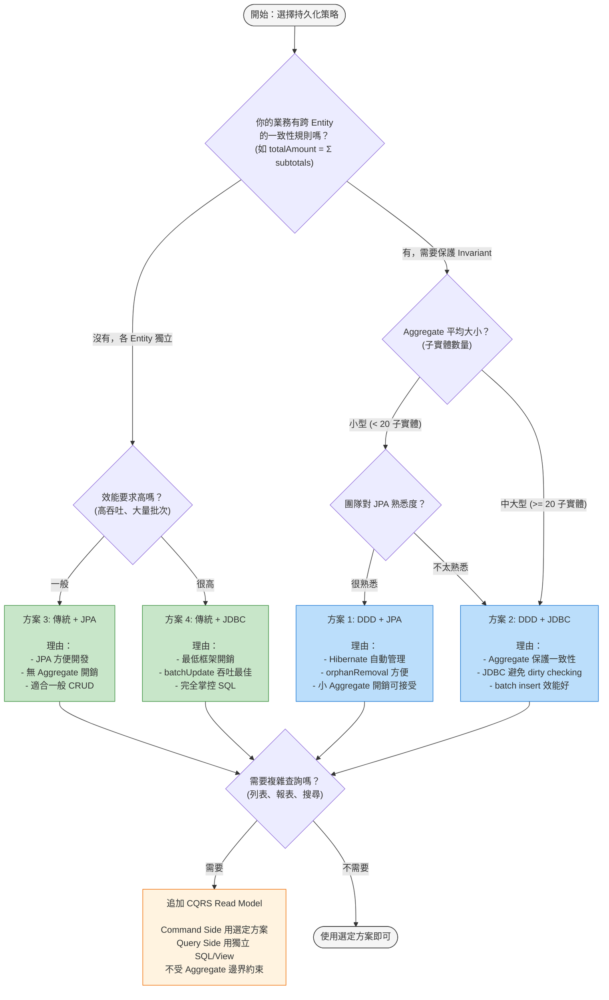

---

## 結語

本 PoC 透過 17 個場景的完整測試，得到以下核心結論：

1. **DDD 的價值不在效能，而在正確性。** Aggregate 用設計約束保護業務一致性（場景 I），加上 JPA `@Version` 的 Optimistic Locking（場景 J），這在團隊擴大、程式碼變複雜時尤其重要。

2. **效能代價是真實且可量化的。** 場景 L（聚合報表）差距 ~70 倍、場景 F（只更新 Status）差距 ~28 倍、場景 H（N+1 列表）差距 ~13 倍。

3. **CQRS 不是可選的，而是必要的。** 場景 D、K、L、N、O 從不同角度證實：一旦採用 DDD Aggregate，Query Side 幾乎必然需要獨立的 Read Model。

4. **DDD + JDBC 是「命令端」的甜蜜點。** 它同時獲得了 Aggregate 的一致性保護和 JDBC 的效能優勢。

5. **批次操作是 DDD 的最大弱點。** 場景 M 的批次狀態更新，DDD+JDBC 需要逐個載入修改，而傳統只需 1 SQL。

5. **選擇的關鍵在於：你的業務複雜度是否值得 DDD 的代價。** 如果 Invariant 簡單、團隊小、場景單純，傳統方案更高效。如果 Invariant 複雜、團隊大、修改頻繁，DDD 的防錯能力會在長期回報。

---

## 術語表 (Glossary)

| 術語 | 英文 | 白話解釋 |
|------|------|---------|
| **Aggregate** | Aggregate | 一組相關物件的「打包」，像是「訂單 + 訂單明細」綁在一起。所有修改都必須透過「老大」(Root) 進行，不能偷偷從後門改。 |
| **Aggregate Root** | Aggregate Root | Aggregate 的「老大」，也是唯一的對外入口。在本 PoC 中就是 `Order` 類別。外部只能跟 Root 說話，不能直接碰 `OrderLineItem`。 |
| **Invariant (業務不變式)** | Business Invariant | 「不管怎麼操作，這個規則永遠不能被違反」的條件。例如：`totalAmount` 永遠等於所有 `subtotal` 的加總。就像銀行帳戶的餘額永遠不能是負數。 |
| **Repository** | Repository | Aggregate 的「倉庫」。它假裝你的 Aggregate 存在一個大集合裡，提供 `save()`/`findById()` 等操作。它隱藏了 SQL 的細節，讓領域層不需要知道資料庫的存在。 |
| **ACL (防腐層)** | Anti-Corruption Layer | 兩個模型之間的「翻譯官」。DDD+JPA 方案中，`DddJpaOrderRepository` 就是 ACL — 它把 Domain Model (`Order`) 翻譯成 JPA Entity (`JpaOrderEntity`)，反之亦然。 |
| **CQRS** | Command Query Responsibility Segregation | 「寫入」和「讀取」分開處理。寫入端用 DDD Aggregate 保護一致性；讀取端用獨立的 SQL/View 自由查詢，不受 Aggregate 邊界限制。 |
| **N+1 問題** | N+1 Query Problem | 查 N 筆父資料，每筆再各查一次子資料，共 N+1 次 SQL。就像去便利商店買 10 樣東西，每樣都單獨結帳一次。正常人會一次全部結帳。 |
| **Dirty Checking** | Dirty Checking | Hibernate 在 `flush()` 時，逐個檢查每個 managed entity 有沒有被修改過。就像老師一個一個檢查學生的作業有沒有被改過。entity 越多，檢查越慢。 |
| **Optimistic Locking** | Optimistic Locking | 用版本號 (`version`) 偵測並發衝突。讀取時記住版本，寫入時檢查版本是否還一樣。如果不一樣表示別人改過了，就拒絕更新。JPA 的 `@Version` 自動做這件事。 |
| **Persistence Context** | Persistence Context | JPA 的「一級快取」。它追蹤所有正在管理的 entity 狀態。就像一個白板，記錄著「誰進來了、誰被改了」。大量操作時這個白板會塞滿，需要定期 `clear()` 擦掉。 |
| **Batch Insert** | Batch Insert | 把多筆 INSERT 打包成一次 DB 往返。就像寄包裹時，10 個包裹一起寄比 10 次各寄 1 個快很多。JDBC 的 `batchUpdate()` 就是這個機制。 |
| **Read Model (讀模型)** | Read Model | CQRS 的 Query Side 專用模型。它是為了「高效查詢」而設計的扁平結構，不受 Aggregate 邊界約束。可以是 DB View、物化視圖、或獨立的查詢 Service。 |
